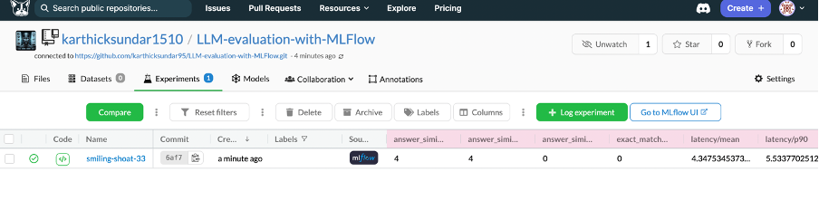
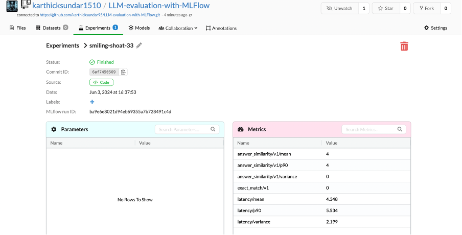

# OpenAI Model Question Answering System with MLflow and DagsHub Integration
Evaluating LLM model with MLFlow and visualizing and tracking results with DagsHub

## Overview

This project demonstrates how to use OpenAI's language models to create a question-answering system, with the integration of MLflow for experiment tracking and DagsHub for dashboarding the metrics live. The goal is to leverage state-of-the-art NLP models and robust tracking tools to create, manage, and monitor machine learning experiments effectively.

## Table of Contents

- [Introduction](#introduction)
- [Features](#features)
- [Architecture](#architecture)
- [Setup and Installation](#setup-and-installation)
- [Usage](#usage)
- [MLflow Tracking](#mlflow-tracking)
- [DagsHub Integration](#dagshub-integration)
- [Contributing](#contributing)
- [License](#license)

## Introduction

This project uses OpenAI's GPT models to build a question-answering system. By integrating MLflow, we can track the performance and parameters of different model runs. Additionally, by connecting MLflow to DagsHub, we can visualize these metrics in real-time on a dashboard, providing a comprehensive view of our experiments.

## Features

- **OpenAI Integration**: Leverage OpenAI's powerful language models for question answering.
- **MLflow Tracking**: Track experiments, including parameters, metrics, and artifacts.
- **DagsHub Dashboard**: Visualize tracked metrics and parameters in real-time using DagsHub.
- **Reproducibility**: Ensure experiments are reproducible and well-documented.

## Architecture

The architecture of this project is designed to be modular and scalable:

1. **OpenAI Model**: Used for generating answers to user questions.
2. **MLflow**: Tracks the experiments, including model parameters, metrics, and artifacts.
3. **DagsHub**: Provides a real-time dashboard for visualizing MLflow metrics.

  <!-- Add your architecture diagram here -->

## Setup and Installation

### Prerequisites

- Python 3.7+
- OpenAI API key
- MLflow
- DagsHub account

### Installation

1. **Clone the repository**:
    ```sh
    git clone https://github.com/yourusername/your-repo-name.git
    cd your-repo-name
    ```

2. **Install dependencies**:
    ```sh
    pip install -r requirements.txt
    ```

3. **Set up environment variables**:
    ```sh
    export OPENAI_API_KEY='your_openai_api_key'
    export MLFLOW_TRACKING_URI='your_mlflow_tracking_uri'
    export DAGSHUB_API_TOKEN='your_dagshub_api_token'
    ```

## Usage

### Running the Question Answering System

1. **Start MLflow server** (if not using a remote server):
    ```sh
    mlflow server --backend-store-uri sqlite:///mlflow.db --default-artifact-root ./mlruns
    ```

2. **Run the application**:
    ```sh
    python app.py
    ```

3. **Interacting with the system**:
    - Use the command line or integrate with a web interface to input questions and receive answers.

## MLflow Tracking

MLflow is used to log:

- **Parameters**: Inputs to your model (e.g., prompt settings, model versions).
- **Metrics**: Performance metrics (e.g., response time, accuracy).
- **Artifacts**: Output artifacts (e.g., response texts, logs).

You can view the MLflow UI at `http://localhost:5000`.

## DagsHub Integration

DagsHub provides a live dashboard for visualizing MLflow metrics. To set up:

1. **Connect MLflow to DagsHub**:
    ```python
    import mlflow
    from dagshub import DAGsHubLogger

    with DAGsHubLogger() as logger:
        mlflow.log_param("param_name", "param_value")
        mlflow.log_metric("metric_name", metric_value)
    ```

2. **View metrics on DagsHub**:
    - Navigate to your project dashboard on DagsHub to see real-time updates.
  



## Contributing

We welcome contributions! Please see our [CONTRIBUTING.md](CONTRIBUTING.md) for guidelines on how to get involved.

## License

This project is licensed under the MIT License - see the [LICENSE](LICENSE) file for details.

---

Feel free to open an issue or submit a pull request if you have any suggestions or improvements.
